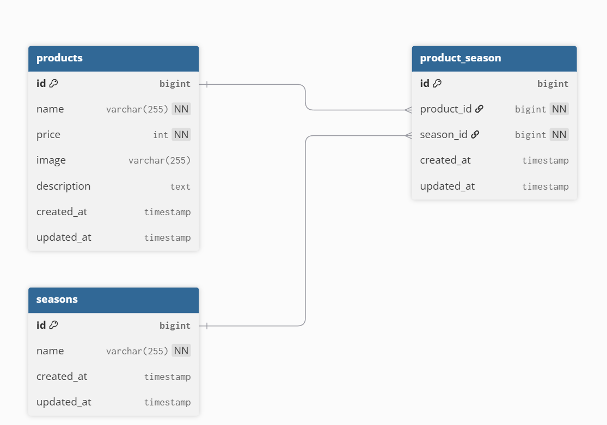

# アプリケーション名  
**mogitate**

## 概要  
季節のフルーツを登録・編集・検索・削除できる商品管理システムです。

## 使用技術・バージョン

| 分類         | 技術・バージョン              |
|--------------|-------------------------------|
| 言語         | PHP 8.x                        |
| フレームワーク | Laravel 8.83.8                |
| データベース | MySQL 8                        |
| Webサーバ    | Nginx                          |
| パッケージ管理 | Composer                     |
| 開発環境     | Docker                         |
| フロント     | Blade, CSS（手書き）           |

## ER図



## 環境構築手順（Docker〜Seederまで）

```bash
# 1. リポジトリをクローン
git clone git@github.com:starmine448357/mogitate.git
cd mogitate/src

# 2. Docker 起動
docker compose up -d --build

# 3. Laravel コンテナに入る
docker exec -it src-php-1 bash

# 4. Composer install
composer install

# 5. .env 設定とアプリキー作成
cp .env.example .env
php artisan key:generate

# 6. マイグレーションとシーディング
php artisan migrate --seed

# 7. ストレージリンク
php artisan storage:link

# 8. アプリへアクセス
http://localhost/products


